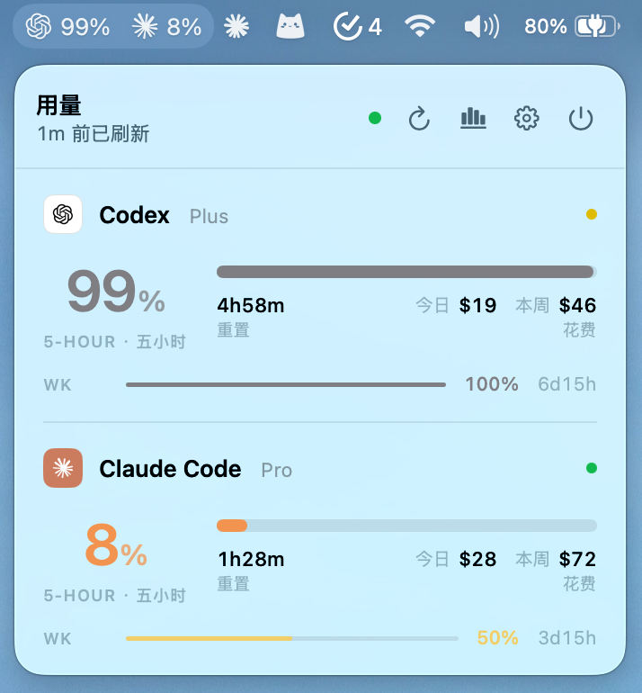
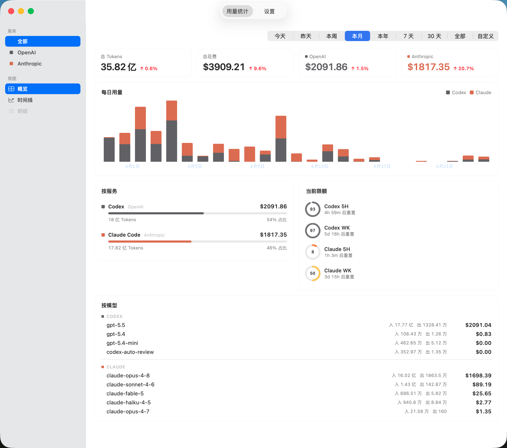

# cc-bar

> macOS 菜单栏小工具 —— 一眼看清 Codex、Claude Code、Kimi Code、GLM Coding Plan 与 Ollama Cloud 的额度与用量。

<p>
  
  
  
</p>

<p align="center">
  
</p>

## 功能

- **多 Provider 额度** —— Codex、Claude Code、Kimi Code、GLM Coding Plan、Ollama Cloud 的主 / 副窗口剩余额度(5 小时 / 周,Ollama 为月 / 周),附带消耗节奏(超前 / 落后 / 预计耗尽)
- **ccpm 联动** —— 自动发现 [ccpm](https://github.com/chang1o/claude-code-profile-manager) profiles:Codex / Claude OAuth 直接读各自凭据,Kimi / GLM 从 ccpm keystore 取 API key,Ollama Cloud 粘贴一次 Cookie;同一 provider 的多个账号在 Popover 分组展示,每个账号一张完整卡片;卡片底部可一键打开用量面板 / 状态页、在 Terminal 里 `ccpm run`、或 `ccpm set-default` 切换默认 profile
- **菜单栏 + 悬浮窗** —— 每个 provider 可单独勾选;支持「仅显示剩余最低的服务」;图标可选百分比文字或竖向量表;可选桌面悬浮 HUD,可拖动、边缘吸附、置顶不抢焦
- **额度通知** —— 剩余 20%、用尽、窗口重置三类本地通知,默认关闭;Claude 的 Extra usage(超额月上限)作为额外窗口显示
- **Token 与费用统计** —— 按账号目录扫描本地 JSONL;按今天 / 昨天 / 本周 / 本月 / 本年 / 7 天 / 30 天 / 全部 / 自定义切换;KPI、堆叠柱状图、按服务占比、按模型与按账号明细;无公开价格的 provider 只显示 token
- **丰富的设置** —— provider 开关、菜单栏显示项 / 模式 / 图标样式、悬浮窗、刷新间隔、额度通知、重置时间显示、中英双语、开机自动启动

<p align="center">
  
</p>

## 安装

要求 macOS 14 Sonoma 或更新版本。已通过终端完成 `codex login` 与 `claude` 登录。

1. 到 [Releases](https://github.com/nanvon/cc-bar/releases) 下载最新 `CCBar.app.zip`,解压后把 `CCBar.app` 拖入 `/Applications`。

2. 首次启动会被 Gatekeeper 拦下。在「应用程序」里**右键 → 打开**,或在终端执行:

   ```bash
   xattr -d com.apple.quarantine /Applications/CCBar.app
   ```

3. 若本机无 `~/.claude/.credentials.json`,会弹出说明后请求 Keychain 授权,请选「**始终允许**」。

4. 要监控 Kimi Code / GLM Coding Plan / Ollama Cloud,用 [ccpm fork](https://github.com/chang1o/claude-code-profile-manager) 建 profile:

   ```bash
   ccpm add kimi-work --provider kimi   # or --provider glm / --provider ollama
   ```

   ccpm 会写入默认 `ANTHROPIC_BASE_URL` 并在启动时把 key 注入为 `ANTHROPIC_AUTH_TOKEN`;cc-bar 重启后自动出现该账号。Ollama Cloud 的额度只在 ollama.com 设置页上,需在「设置 → ccpm 账号」为该 profile 粘贴一次 Cookie 头。

## 反馈

请到 [Issues](https://github.com/nanvon/cc-bar/issues) 留言。

## 致谢

cc-bar 在设计与实现上参考了以下优秀的开源项目,在此特别感谢:

- [cc-switch](https://github.com/farion1231/cc-switch) —— 多 Provider 账号切换器,启发了本项目的多账号管理与导入流程
- [cockpit-tools](https://github.com/jlcodes99/cockpit-tools) —— 多平台 AI 编码助手仪表盘,在额度与刷新策略上提供了参考
- [CodexBar](https://github.com/steipete/CodexBar) —— macOS 菜单栏 AI 用量监控,在菜单栏交互与本地解析思路上多有借鉴
