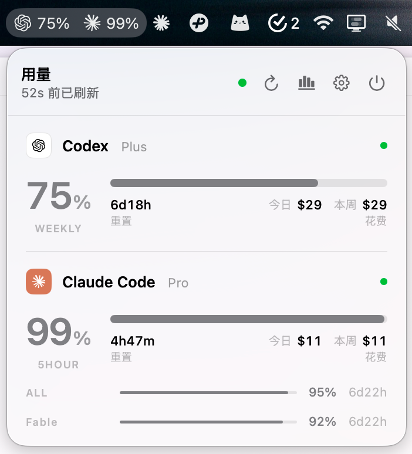
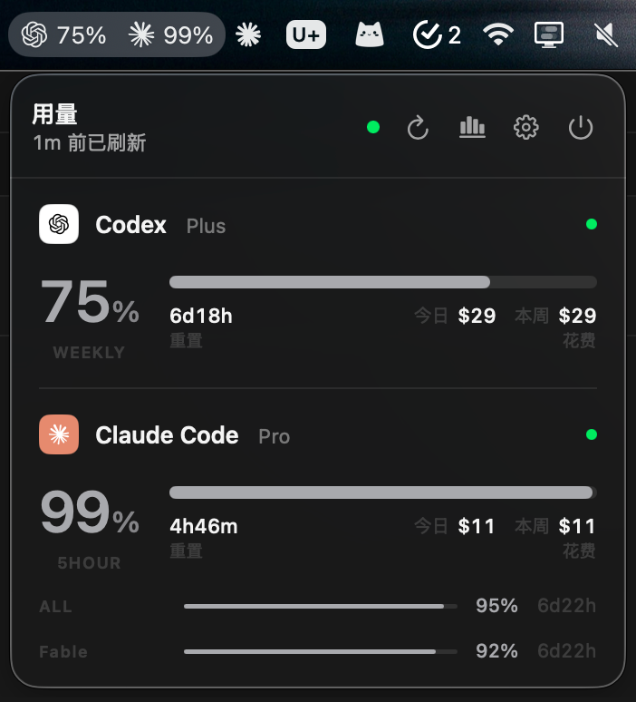
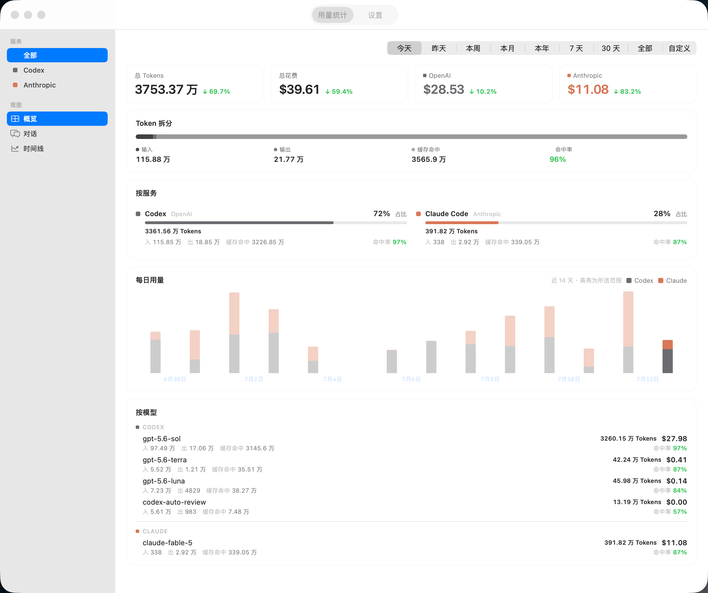
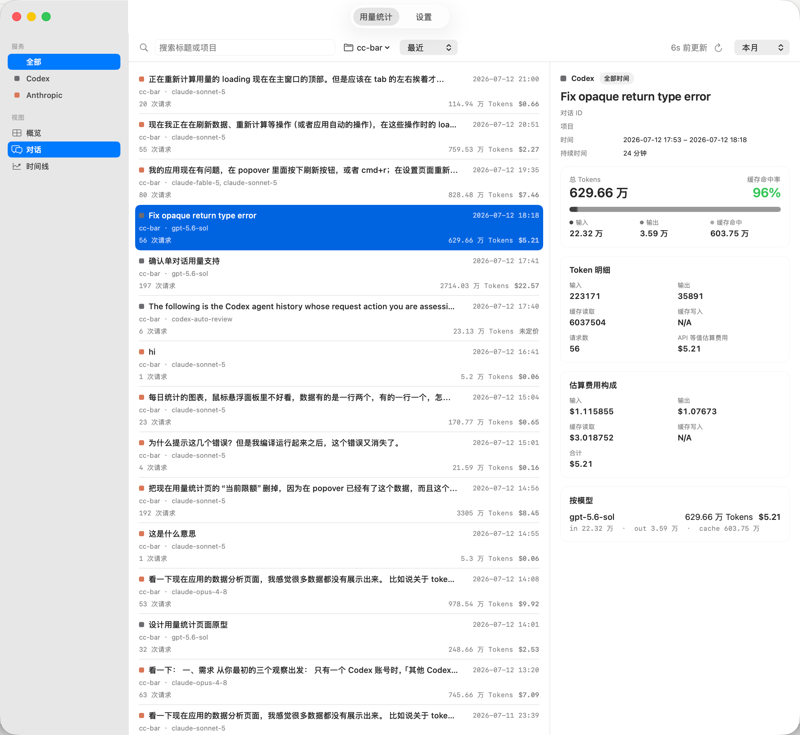
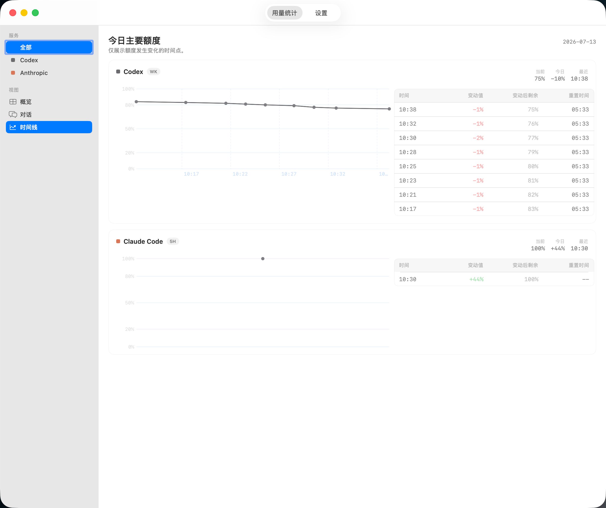

<p align="center">
  
</p>

<h1 align="center">cc-bar</h1>

<p align="center">macOS 菜单栏工具:实时显示 Codex、Claude Code 与 Antigravity 的剩余额度,<br>并统计本机的 Token 用量与费用。</p>

<p align="center">
  
  
  <a href="https://github.com/nanvon/cc-bar/releases/latest"></a>
  
  
</p>

<p align="center">
  <a href="https://github.com/nanvon/cc-bar/releases/latest">下载</a> ·
  <a href="#-安装">安装</a> ·
  <a href="#-从源码构建">从源码构建</a> ·
  <a href="#-相关项目">相关项目</a> ·
  <a href="https://github.com/nanvon/cc-bar/issues">反馈</a> ·
  <a href="README_EN.md">English</a>
</p>

<p align="center">
  
  
</p>

## ✨ 功能

- **额度总览** —— Codex、Claude Code、Antigravity 的 5 小时 / 周窗口剩余额度,菜单栏图标直接显示剩余百分比
- **悬浮 HUD** —— 可选的桌面悬浮窗,可拖动、边缘吸附、置顶且不抢焦点
- **多 Codex 账号** —— 导入多个 Codex 账号,主副账号在 Popover 同屏展示;设置页可查看每个账号的额外重置次数与到期时间
- **用量统计** —— 汇总 Codex、Claude Code、Pi 与 OpenCode 的 Token 用量与费用,按今天 / 昨天 / 本周 / 本月 / 本年 / 近 7 天 / 近 30 天 / 全部 / 自定义范围切换,支持按服务、按模型、按单个对话、按模型提供商拆分,并带每日用量图表
- **周期用量** —— 按 Codex / Claude 主账号真实重置窗口统计本机 Tokens 与费用,给出用满预估与重置倒计时
- **额度时间线** —— 5 小时窗口额度随时间变化的记录
- **服务状态** —— Popover 中显示 OpenAI / Anthropic 官方状态页圆点
- **设置项** —— 账号开关、菜单栏显示内容、悬浮窗、刷新间隔、服务状态、价格目录更新、重新计算用量、重置时间显示、隐私模式、中英双语、开机自启

### 📸 界面预览

<p align="center">
  <br>
  <sub>概览:Token / 费用汇总,按服务与模型拆分</sub>
</p>

<p align="center">
  <br>
  <sub>对话:按单个对话查看 Token 与费用明细</sub>
</p>

<p align="center">
  <br>
  <sub>时间线:5 小时窗口额度随时间变化</sub>
</p>

## 📦 安装

🍎 要求 macOS 14 (Sonoma) 或更新版本。Codex / Claude Code 需已在终端完成登录;Antigravity 需安装官方 App 或 IDE,并在运行时提供本地额度服务。

1. 从 [Releases](https://github.com/nanvon/cc-bar/releases/latest) 下载 `CCBar.dmg`(或备用的 `CCBar.app.zip`),把 `CCBar.app` 拖入 `/Applications`。
2. CCBar 未做 Apple 公证,首次启动会被 Gatekeeper 拦截:双击打开被拦下后,到 **系统设置 → 隐私与安全性**,下滑找到 CCBar 的提示,点 **「仍要打开」**。
3. 若本机没有 `~/.claude/.credentials.json`,应用会在弹出说明后请求 Keychain 授权,请选 **「始终允许」**。

> [!NOTE]
> macOS Sequoia 起,旧的「右键 → 打开」放行方式已失效,只能通过上面的系统设置放行。
> 若仍提示「应用程序已损坏」,可在终端手动去除隔离属性:
>
> ```bash
> xattr -dr com.apple.quarantine /Applications/CCBar.app
> ```

## 🔒 数据与安全

cc-bar 是为个人需求开发的开源小工具。为了查询额度,它会读取本地凭据:

- Codex:`~/.codex/auth.json`。access_token 临期时会用 refresh_token 续期并写回;续期前先重读一次文件,`codex` CLI 已经自己刷过就直接采用,不去跟它抢
- Claude Code:`~/.claude/.credentials.json` 与 macOS Keychain,**只读**。cc-bar 不刷新、也不写回 Claude 的凭据 —— Anthropic 的 refresh_token 是一次性的,第三方刷新会把你从 Claude Code 挤下线。凭据过期时保留上一次额度快照并提示你去 Claude Code 刷新登录,本地 Token / 费用统计不受影响
- Antigravity:仅连接官方进程在 `127.0.0.1` 暴露的本地 Language Server,不保存 Google OAuth 凭据,不启动 CLI,也不发送模型请求

用量统计基于扫描本机会话日志得出:Codex(`~/.codex/sessions` 与 `~/.codex/archived_sessions`)、Claude Code(`~/.claude/projects`)与 Pi(pi coding agent,日志位于 `~/.pi/agent/sessions`)的 JSONL 日志,以及 OpenCode 的 SQLite 会话库(`~/.local/share/opencode/opencode.db`,只读打开)。

> [!TIP]
> 发布的 `CCBar.app` 为 ad-hoc 签名、未做 Apple 公证;如果介意,可以自行审阅代码后[从源码构建](#-从源码构建),不依赖发布的二进制包。

## 🔧 从源码构建

需要完整版 Xcode(仅 Command Line Tools 不够)。

**日常开发**:双击 `ccbar.xcodeproj`,选择 scheme `ccbar` 与「My Mac」,⌘R 运行。

**打包分发**:

```bash
# 首次需将命令行工具指向完整 Xcode(一次性)
sudo xcode-select -s /Applications/Xcode.app/Contents/Developer

# Release 构建 + 打包,产物输出到 dist/CCBar.dmg 与 dist/CCBar.app.zip
./scripts/build.sh
```

脚本以 `CODE_SIGNING_ALLOWED=NO` 构建,产物为 ad-hoc 签名,可在任意 Mac 上运行,无需付费证书或公证。

> [!WARNING]
> 不要用 Xcode 的 Archive 导出分发:那会引入 "Apple Development" 开发证书,产物只能在本机运行。

## 🔗 相关项目

同一作者的三个应用,共享同一套额度口径与视觉语言:

|                                                                  |                                        |
| ---------------------------------------------------------------- | -------------------------------------- |
| **cc-bar**(本仓库)                                             | macOS 原生菜单栏版(SwiftUI)          |
| [**CC Trace**](https://github.com/nanvon/cc-trace)               | 桌面端 · macOS 菜单栏 / Windows 托盘   |
| [**CC Trace Mobile**](https://github.com/nanvon/cc-trace-mobile) | 移动端 · iOS / Android                 |

CC Trace 在 cc-bar 的功能基础上用 Tauri 重构,同时支持 macOS 与 Windows。三个应用相互独立,数据与设置不互通。

## 🙏 致谢

设计与实现参考了以下开源项目:

- [cc-switch](https://github.com/farion1231/cc-switch) —— 多 Provider 账号切换器,启发了多账号管理与导入流程
- [cockpit-tools](https://github.com/jlcodes99/cockpit-tools) —— 多平台 AI 编码助手仪表盘,在额度与刷新策略上提供了参考
- [CodexBar](https://github.com/steipete/CodexBar) —— macOS 菜单栏 AI 用量监控,在菜单栏交互与本地解析思路上多有借鉴

## 📄 许可证

[MIT](LICENSE)
